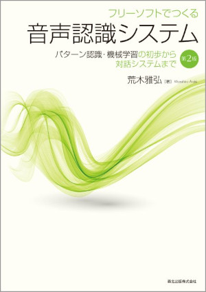

# フリーソフトでつくる音声認識システム（第2版）

* 荒木雅弘: 『フリーソフトでつくる音声認識システム（第2版）』（森北出版，2017年）のサポートページです。
* https://masahiroaraki.github.io/SpeechRecognition/

* [スライド](https://github.com/MasahiroAraki/SpeechRecognition/tree/master/slide)
* [Scilab コード](https://github.com/MasahiroAraki/SpeechRecognition/tree/master/scilab)
* 参考 [Python コード](https://github.com/MasahiroAraki/SpeechRecognition/tree/master/Python)

<a href="https://www.docswell.com/s/MasahiroAraki/58GW69-2023-07-31-092932"> 第1章 </a>

